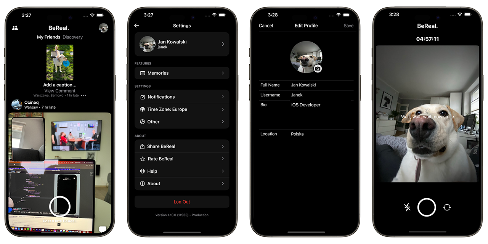
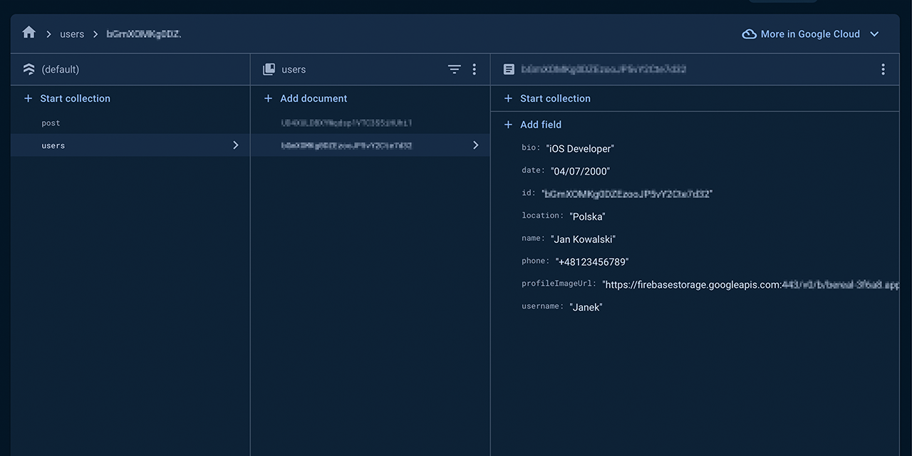
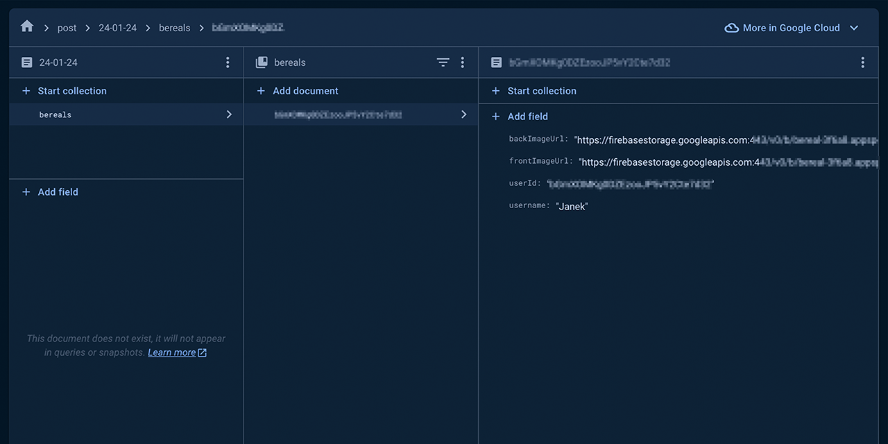

# BeReal Clone

Welcome to the BeReal Clone project! This iOS application enables users to capture and upload photos from both the front and rear cameras, creating posts within the app. All data is securely stored in Firebase. The application includes user registration and login functionalities. During registration, user verification is implemented through a 6-digit verification code sent to the provided phone number.

## Features

- **Photo Capture**: Users can take photos using both the front and rear cameras.
- **Firebase Integration**: All data, including user information and uploaded photos, is stored securely in Firebase.
- **User Authentication**: The app supports user registration and login processes.
- **Phone Number Verification**: During registration, users are required to verify their identity through a 6-digit code sent to their provided phone number.
- **Swift and SwiftUI**: The application is written in Swift, making use of SwiftUI for a modern and intuitive user interface.
- **Data CRUD Operations**: The application supports Create, Read, Update, and Delete (CRUD) operations in Firebase, allowing users to save, retrieve, and edit data.
- **External Libraries**: Utilizes external libraries such as Kingfisher for efficient image loading and caching.

## Technologies Used

- **Swift**: The primary programming language for iOS development.
- **SwiftUI**: A framework for building user interfaces.
- **Firebase**: Cloud-based platform for backend services, including data storage and authentication.
- **Kingfisher**: External library for efficient image loading and caching.

## Getting Started

1. Clone the repository to your local machine.
2. Open the project in Xcode.
3. Set up Firebase configuration with your own credentials.
4. Build and run the application on your iOS simulator or device.

## Dependencies

Ensure you have the following dependencies installed before running the application:

- [Firebase SDK](https://firebase.google.com/docs/ios/setup)
- [Kingfisher](https://github.com/onevcat/Kingfisher)

## Screenshots

*Screenshot: Feed Screen, Setting View with working features such as Sign Out user, Edit Profile View and Camera View.*

*Screenshot: Sample user saved in Firebase.*

*Screenshot: Sample BeReal post saved in Firebase*
